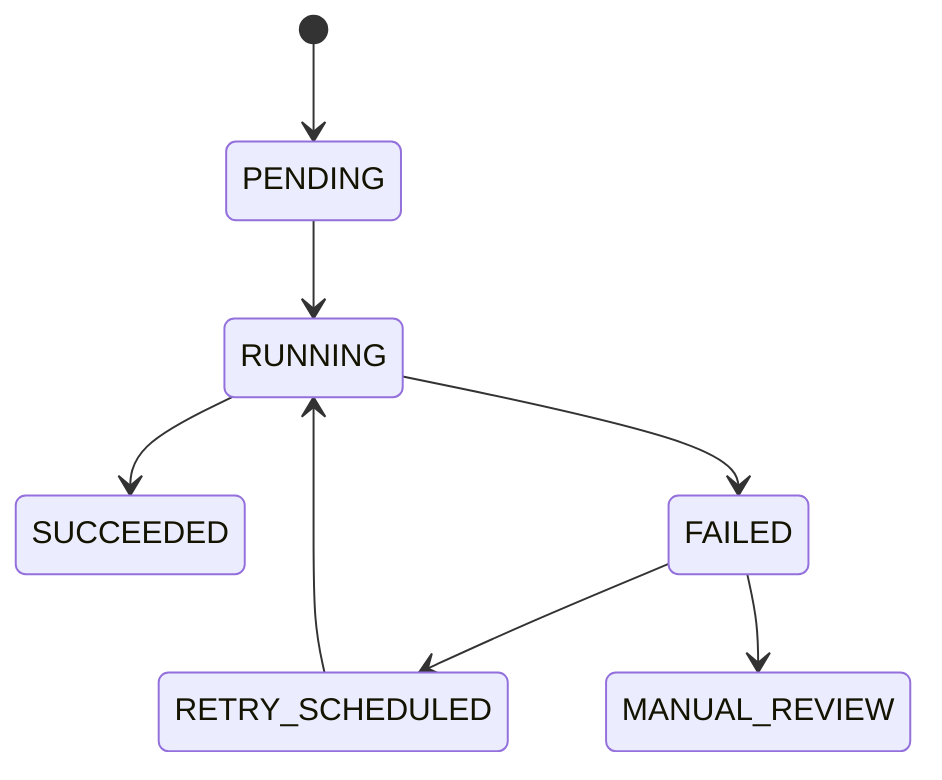

# Zadania Asynchroniczne

## Cel dokumentu
Opisuje zadania wykonywane poza ścieżką HTTP i sposób ich projektowania.

## Status dokumentu
- Status: draft
- Zakres: background jobs dla stanu docelowego
- Ostatnia aktualizacja: 2026-07-12

## Stan obecny
- Mechanizm background jobs nie jest jeszcze wybrany ani zaimplementowany.

## Stan docelowy
- Niezawodne wykonywanie przetwarzania mediów, tworzenia ZIP, cleanupów i zadań retencyjnych.

## Typy zadań
- Generowanie miniaturek zdjęć
- Generowanie preview filmu
- Ekstrakcja metadanych technicznych
- Generowanie archiwum ZIP
- Retry nieudanych przetwarzań
- Cleanup soft deleted zasobów
- Reagregacja `StorageUsage`
- Wysyłka powiadomień asynchronicznych

## Wymagania
- Idempotentność
- Odporność na restart procesu
- Widoczny status i liczba prób
- Możliwość retry ręcznego i automatycznego
- Ograniczenie współbieżności dla kosztownych zadań

## Cykl życia zadania

## Model wykonania
- Preferowany start: jobi zapisane w PostgreSQL i worker uruchamiany z tej samej codebase.
- API zapisuje zlecenie, a worker pobiera zadania wsadowo.
- Długie operacje nie powinny być wykonywane w wątku requestu.

## Generowanie ZIP

## Zasady retry
- Retry tylko dla błędów przejściowych.
- Po przekroczeniu limitu prób zadanie przechodzi do stanu wymagającego interwencji.
- Powód błędu zapisujemy w rekordzie joba i logach.

## Powiązane dokumenty
- [MEDIA_PROCESSING.md](../backend/MEDIA_PROCESSING.md)
- [FILE_STORAGE.md](FILE_STORAGE.md)
- [../adr/0007-background-jobs.md](../adr/0007-background-jobs.md)

## Decyzje otwarte
- Czy użyć mechanizmu scheduler + tabela jobów, czy dołożyć lekką bibliotekę kolejkową do monolitu.
