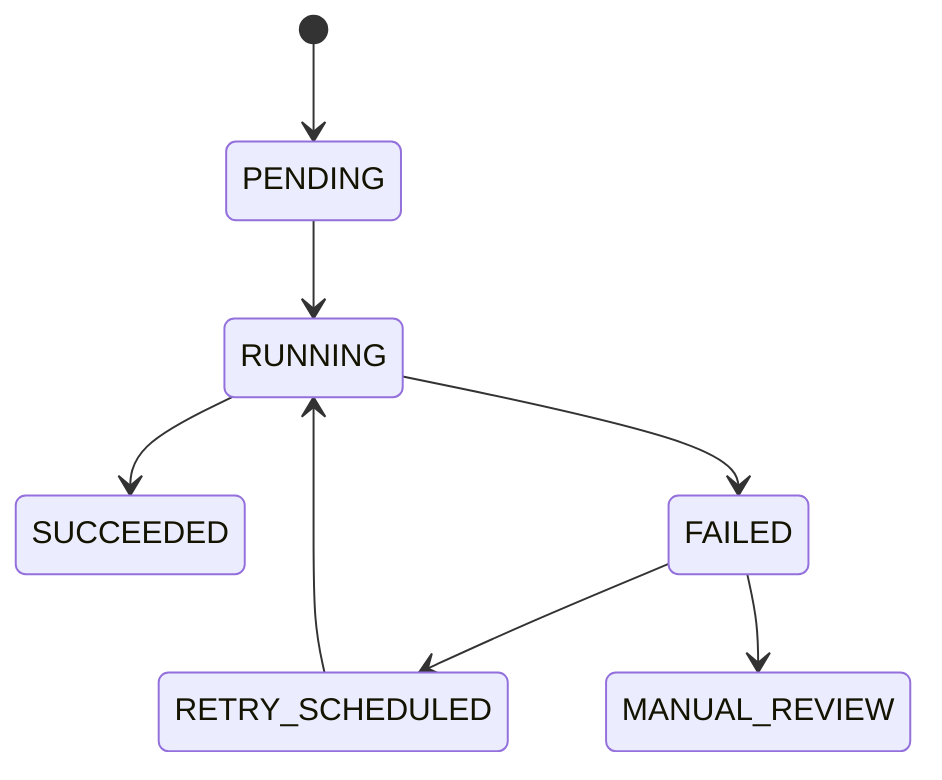

# Zadania Asynchroniczne

## Cel dokumentu
Opisuje zadania wykonywane poza sciezka HTTP i sposob ich projektowania.

## Status dokumentu
- Status: draft
- Zakres: background jobs dla stanu docelowego
- Ostatnia aktualizacja: 2026-07-21

## Stan obecny
- Pierwszy mechanizm background jobs jest zaimplementowany dla media processingu.
- Upload ma lokalny scheduler cleanupu oraz tworzy trwaly job domenowy po udanym zapisie oryginalu.

## Stan docelowy
- Niezawodne wykonywanie przetwarzania mediow, tworzenia ZIP, cleanupow i zadan retencyjnych.

## Implementacja Etapu 6
- Mechanizm: tabela jobow w MySQL i in-process worker w backendzie.
- Model musi byc kompatybilny z pozniejszym uruchomieniem osobnego procesu workera tej samej aplikacji.
- Pierwszym konsumentem mechanizmu jest `PROCESS_MEDIA`.

## Typy zadan
- Generowanie miniaturek zdjec
- Ekstrakcja metadanych technicznych
- Generowanie preview filmu w pozniejszym etapie
- Generowanie archiwum ZIP
- Retry nieudanych przetwarzan
- Cleanup soft deleted zasobow
- Reagregacja `StorageUsage`
- Wysylka powiadomien asynchronicznych

## Wymagania
- Idempotentnosc
- Odpornosc na restart procesu
- Widoczny status i liczba prob
- Mozliwosc retry recznego i automatycznego
- Ograniczenie wspolbieznosci dla kosztownych zadan
- Brak dlugich operacji IO w transakcji HTTP
- Brak ujawniania sciezek storage i sekretow w bledach lub logach

## Cykl zycia zadania

## Model wykonania
- API zapisuje zlecenie jako rekord joba w tej samej transakcji, w ktorej powstaje zdarzenie biznesowe wymagajace pracy w tle.
- Worker pobiera zadania wsadowo, atomowo claimuje rekord i oznacza go jako `RUNNING`.
- Claim musi byc bezpieczny przy wielu workerach. Strategia blokowania zostanie potwierdzona testem na MySQL.
- `attempt_count`, `scheduled_at`, `started_at`, `finished_at`, `locked_at`, `locked_by`, `last_error_code` i `last_error_message` sluza do retry i diagnostyki.
- Dlugie operacje nie powinny byc wykonywane w watku requestu.
- Claim, retry i terminalny wynik sa logowane technicznie bez sciezek storage i sekretow.
- Terminalny wynik media processingu zapisuje best-effort systemowy audit event; samo przejscie `RETRY_SCHEDULED` pozostaje logiem operacyjnym, nie zdarzeniem biznesowym.

## Zasady retry
- Retry tylko dla bledow przejsciowych.
- Backoff powinien byc deterministyczny i ograniczony limitem prob.
- Po przekroczeniu limitu prob zadanie przechodzi do stanu wymagajacego interwencji albo trwalego `FAILED`.
- Powod bledu zapisujemy w rekordzie joba i logach bez danych wrazliwych.

## Generowanie ZIP

## Powiazane dokumenty
- [MEDIA_PROCESSING.md](../backend/MEDIA_PROCESSING.md)
- [FILE_STORAGE.md](FILE_STORAGE.md)
- [../adr/0007-background-jobs.md](../adr/0007-background-jobs.md)

## Decyzje otwarte
- Endpoint recznego retry zostaje odlozony do admin API albo osobnego zakresu operacyjnego; model danych Etapu 6 przechowuje status, liczbe prob i kody bledow wymagane do takiej akcji.
