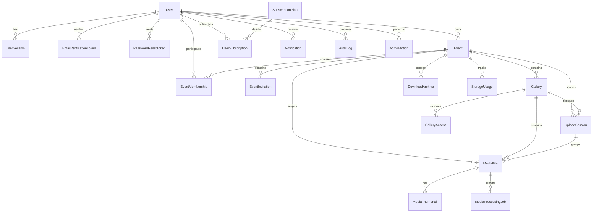

# Model Danych

## Cel dokumentu
Opisuje docelowy model danych, główne encje, relacje, indeksy i zasady ownership.

## Status dokumentu
- Status: draft
- Zakres: model danych dla stanu docelowego
- Ostatnia aktualizacja: 2026-07-20

## Stan obecny
- Zaimplementowane sa tabele `users`, `events`, `event_memberships`, `galleries` i `audit_events` zarzadzane przez Flyway.
- Etap 3 dodal `privacy_mode`, lifecycle/soft delete i optimistic version wydarzenia oraz historyczne membership managerow.
- Etap 4 zaimplementowal `Gallery` w zakresie GALLERY-001: scoped management API, stabilny slug, kolejnosc, lifecycle, soft delete, optimistic version i audyt.
- Etap 4B/5 dodal ustawienia publikacji i quota do `galleries`, hashowane `gallery_accesses`, `upload_sessions` oraz `media_files` zarzadzane migracjami V3/V4.
- Pozostale encje opisane ponizej nadal stanowia stan docelowy.

## Stan docelowy
- Relacyjny model danych zoptymalizowany pod wieloużytkownikowość, audyt i pracę na plikach.

## Zasady modelowania
- Każdy zasób biznesowy ma właściciela lub kontekst wydarzenia.
- Dane współdzielone między wydarzeniami są ograniczone do bytów systemowych.
- Soft delete stosujemy tam, gdzie potrzebna jest retencja, audyt lub przywracanie.
- Indeksy muszą wspierać typowe zapytania zawężane po `owner_id`, `event_id`, `gallery_id`, statusie i dacie.

## Encje
### User
- Przeznaczenie: konto użytkownika.
- Pola: `id`, `email`, `password_hash`, `first_name`, `last_name`, `status`, `locale`, `profile_image_key`, `created_at`, `updated_at`, `deleted_at`.
- Relacje: 1:N do `UserSession`, `Event`, `EventMembership`, `EventInvitation`, `UserSubscription`, `Notification`.
- Ograniczenia: unikalny `email`, status aktywności, soft delete.
- Indeksy: `email`, `status`.

### UserSession
- Przeznaczenie: aktywna lub historyczna sesja użytkownika.
- Pola: `id`, `user_id`, `token_hash`, `refresh_token_hash`, `device_info`, `ip_address`, `expires_at`, `revoked_at`, `created_at`.
- Relacje: N:1 do `User`.
- Indeksy: `user_id`, `expires_at`, `revoked_at`.

### EmailVerificationToken
- Przeznaczenie: potwierdzenie adresu e-mail.
- Pola: `id`, `user_id`, `token_hash`, `expires_at`, `used_at`, `created_at`.
- Ograniczenia: tylko aktywny token na użytkownika według polityki implementacyjnej.

### PasswordResetToken
- Przeznaczenie: reset hasła.
- Pola: `id`, `user_id`, `token_hash`, `expires_at`, `used_at`, `created_at`.

### Event
- Przeznaczenie: główny byt biznesowy grupujący galerie i członków.
- Pola zaimplementowane: `id`, `owner_user_id`, `name`, `type`, `event_date`, `description`, `status`, `privacy_mode`, `archived_at`, `created_at`, `updated_at`, `deleted_at`, `version`.
- Relacje: 1:N do `Gallery`, `EventMembership`, `EventInvitation`, `StorageUsage`.
- Indeksy: `owner_user_id`, `(owner_user_id, status)`, `event_date`.

### EventMembership
- Przeznaczenie: rola użytkownika w wydarzeniu.
- Pola zaimplementowane: `id`, `event_id`, `user_id`, `role`, `joined_at`, `removed_at`, `created_at`, `updated_at`, `version`.
- Aktualnie membership przechowuje `MANAGER`; `OWNER` pozostaje wyliczany z wydarzenia.
- Ograniczenia: unikalność `(event_id, user_id)`.
- Indeksy: `(user_id, role)`, `(event_id, role)`.

### EventInvitation
- Przeznaczenie: zaproszenie do wydarzenia.
- Pola: `id`, `event_id`, `invited_email`, `invited_user_id`, `role`, `token_hash`, `status`, `expires_at`, `accepted_at`, `created_by_user_id`, `created_at`.
- Indeksy: `(event_id, invited_email)`, `token_hash`, `status`.

### Gallery
- Przeznaczenie: galeria w ramach wydarzenia.
- Pola zaimplementowane: `id`, `event_id`, `name`, `slug`, `description`, `status`, `sort_order`, `public_view_enabled`, `upload_enabled`, `download_enabled`, `moderation_mode`, `access_code_hash`, `published_at`, `expires_at`, `storage_used_bytes`, `storage_reserved_bytes`, `archived_at`, `deleted_at`, `created_at`, `updated_at`, `version`.
- Pola planowane w kolejnych etapach: `cover_media_file_id`, `visibility_mode`, `theme_key`.
- Ograniczenia: `slug` jest globalnie unikalny i pozostaje zarezerwowany po soft delete; galeria zawsze nalezy do jednego wydarzenia.
- Indeksy: `(event_id, status)`, `(event_id, deleted_at, sort_order)`, `deleted_at`, unikalny `slug`.

### GalleryAccess
- Przeznaczenie: kontrola dostępu publicznego.
- Pola zaimplementowane: `id`, `gallery_id`, `token_hash`, `revoked_at`, `created_at`, `version`. Token raw jest jednorazowo zwracany ownerowi; baza przechowuje SHA-256.
- Indeksy: `(gallery_id, revoked_at)` oraz unikalny `token_hash`.

### MediaFile
- Przeznaczenie: metadane zdjęcia lub filmu.
- Pola zaimplementowane w Etapie 5: `id`, `gallery_id`, `upload_session_id`, `client_file_id`, `original_filename`, `storage_key`, `expected_size_bytes`, `size_bytes`, `declared_content_type`, `detected_content_type`, `media_type`, `status`, `checksum_sha256`, `failure_code`, `stored_at`, timestampy i `version`.
- Pozostale metadane publikacji i przetwarzania sa planowane w Etapach 6-8.
- Relacje: N:1 do `Gallery` i `UploadSession`; kontekst wydarzenia wynika z galerii. Docelowo 1:N do `MediaThumbnail` i `MediaProcessingJob`.
- Indeksy: `(upload_session_id, status)`, `(gallery_id, status, stored_at)`, unikalny `storage_key` oraz unikalny `(upload_session_id, client_file_id)`.

### MediaProcessingJob
- Uwaga Etapu 6: startowy model joba powinien dodac `max_attempts`, `locked_at`, `locked_by`, `updated_at` i `version`; unikalnosc `(media_file_id, job_type)` broni idempotencji, a indeksy `(status, scheduled_at)` i `(status, locked_at)` wspieraja claim workera oraz odzyskiwanie porzuconych lockow.
- Przeznaczenie: zadanie przetwarzania mediów.
- Pola: `id`, `media_file_id`, `job_type`, `status`, `attempt_count`, `last_error_code`, `last_error_message`, `scheduled_at`, `started_at`, `finished_at`, `created_at`.
- Indeksy: `(status, scheduled_at)`, `(media_file_id, job_type)`.

### MediaThumbnail
- Przeznaczenie: zapis wygenerowanych miniaturek lub podglądów.
- Pola: `id`, `media_file_id`, `variant`, `storage_key`, `width`, `height`, `size_bytes`, `created_at`.
- Ograniczenia: unikalność `(media_file_id, variant)`.

### UploadSession
- Przeznaczenie: grupuje upload jednego lub wielu plików.
- Pola zaimplementowane: `id`, `gallery_id`, `public_access_id`, `grant_fingerprint`, `idempotency_key`, `request_fingerprint`, `status`, `total_files`, `total_bytes`, `reserved_bytes`, `expires_at`, `cancelled_at`, timestampy i `version`.
- Indeksy: `(gallery_id, status, created_at)`, `(public_access_id, status, created_at)` oraz unikalny `(grant_fingerprint, idempotency_key)` po migracji V4.

### DownloadArchive
- Przeznaczenie: asynchronicznie generowane archiwum ZIP.
- Pola: `id`, `event_id`, `gallery_id`, `requested_by_user_id`, `scope_type`, `status`, `storage_key`, `expires_at`, `download_token_hash`, `error_message`, `created_at`, `completed_at`.
- Indeksy: `(requested_by_user_id, created_at)`, `(status, created_at)`.

### StorageUsage
- Przeznaczenie: agregacja wykorzystania storage.
- Pola: `id`, `user_id`, `event_id`, `gallery_id`, `bytes_used`, `bytes_soft_deleted`, `calculated_at`.
- Indeksy: `user_id`, `event_id`, `gallery_id`.

### SubscriptionPlan
- Przeznaczenie: definicja planu i limitów.
- Pola: `id`, `code`, `name`, `status`, `max_storage_bytes`, `max_events`, `max_galleries_per_event`, `max_file_size_bytes`, `retention_days`, `zip_download_enabled`, `max_event_managers`, `customization_level`, `created_at`, `updated_at`.
- Ograniczenia: unikalny `code`.

### UserSubscription
- Przeznaczenie: przypisanie planu do użytkownika.
- Pola: `id`, `user_id`, `plan_id`, `status`, `starts_at`, `ends_at`, `assigned_by_admin_id`, `created_at`, `updated_at`.
- Indeksy: `user_id`, `(status, ends_at)`.

### Notification
- Przeznaczenie: zapis zdarzeń notyfikacyjnych.
- Pola: `id`, `user_id`, `channel`, `type`, `status`, `payload_json`, `sent_at`, `failed_at`, `created_at`.
- Indeksy: `(user_id, created_at)`, `(type, status)`.

### AuditLog
- Przeznaczenie: ślad audytowy.
- Pola: `id`, `actor_type`, `actor_user_id`, `action_type`, `resource_type`, `resource_id`, `event_id`, `result`, `ip_address`, `correlation_id`, `context_json`, `created_at`.
- Indeksy: `(resource_type, resource_id)`, `(actor_user_id, created_at)`, `event_id`, `action_type`.

### SystemSetting
- Przeznaczenie: ustawienia konfiguracyjne systemu.
- Pola: `id`, `setting_key`, `setting_value`, `value_type`, `updated_by_admin_id`, `updated_at`.
- Ograniczenia: unikalny `setting_key`.

### AdminAction
- Przeznaczenie: jawny zapis działań administracyjnych.
- Pola: `id`, `admin_user_id`, `action_type`, `target_type`, `target_id`, `reason`, `status`, `details_json`, `created_at`.
- Indeksy: `(admin_user_id, created_at)`, `(target_type, target_id)`.

## Diagram ERD

## Zasady usuwania
- `User`, `Event`, `Gallery`, `MediaFile` wspierają soft delete.
- Hard delete plików wymaga skoordynowanego usunięcia rekordu i obiektu storage.
- `AuditLog` i `AdminAction` nie powinny być usuwane operacyjnie poza polityką retencji zgodną z wymaganiami prywatności.

## Ownership
- `Event.owner_user_id` jest główną osią ownership.
- `Gallery.event_id` dziedziczy ownership z wydarzenia.
- `MediaFile` musi wskazywać `event_id` i `gallery_id`; opcjonalnie `owner_user_id` wskazuje konto właściciela wydarzenia.
- Dostęp użytkownika jest wyliczany przez ownership albo `EventMembership`.

## Powiązane dokumenty
- [MULTI_TENANCY.md](MULTI_TENANCY.md)
- [../backend/DATABASE_CONVENTIONS.md](../backend/DATABASE_CONVENTIONS.md)
- [../product/PERMISSIONS_MATRIX.md](../product/PERMISSIONS_MATRIX.md)

## Decyzje otwarte
- ADR 0010 jest zaakceptowany, a slug jest publicznym, globalnie unikalnym i stabilnym identyfikatorem galerii. Ewentualny dodatkowy alias lub zmiana strategii URL wymaga osobnej decyzji.
