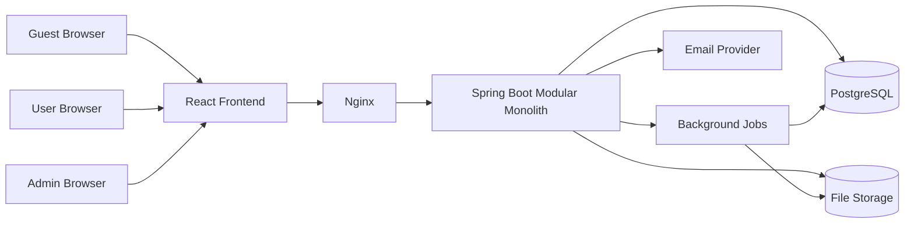
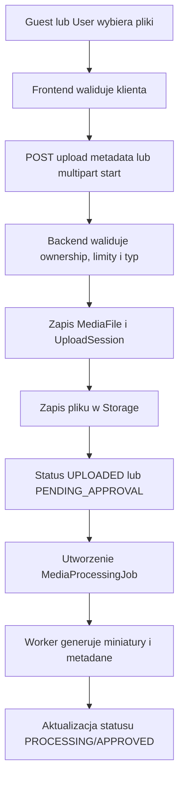
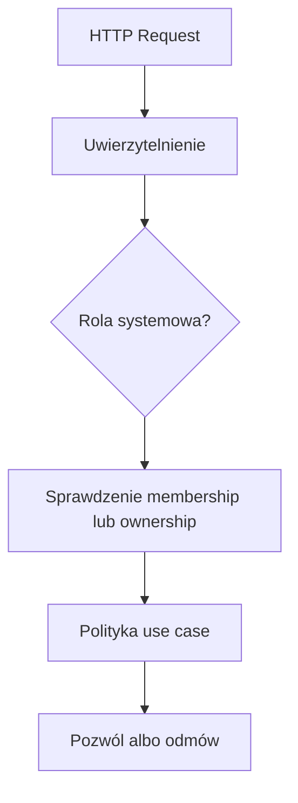

# Architektura Systemu

## Cel dokumentu
Opisuje docelową architekturę systemu, główne komponenty i przepływy między nimi.

## Status dokumentu
- Status: draft
- Zakres: architektura docelowa modularnego monolitu
- Ostatnia aktualizacja: 2026-07-12

## Stan obecny
- W repozytorium istnieje jedynie szkic backendu i frontendu.
- Obecny kod nie odzwierciedla jeszcze docelowych modułów ani kompletnej architektury.

## Stan docelowy
- Modularny monolit uruchamiany jako jedna aplikacja backendowa i jeden frontend SPA.
- Wydzielone moduły domenowe i integracyjne.
- Jedna baza PostgreSQL i abstrakcja storage dla plików.

## Widok wysokiego poziomu

## Zasady architektoniczne
- Monolit modularny zamiast mikroserwisów.
- Moduły organizowane według domen biznesowych.
- Warstwa API nie omija logiki use case.
- Ownership, autoryzacja i audyt są częścią logiki aplikacyjnej, nie tylko kontrolerów.
- Storage i zadania tła są ukryte za interfejsami.

## Warstwy backendu
- Domena: encje, agregaty, polityki biznesowe, enumy.
- Application/use case: orkiestracja przypadków użycia, transakcje, autoryzacja serwisowa.
- Infrastructure: JPA, storage, poczta, kolejki zadań, generowanie ZIP, przetwarzanie mediów.
- API: REST, DTO, walidacja wejścia, mapowanie błędów.
- Integracje: provider e-mail, storage obiektowy, generatory QR.

## Główne przepływy
- Rejestracja i sesja użytkownika
- Zarządzanie wydarzeniem i członkostwem
- Publiczny dostęp do galerii
- Upload i przetwarzanie mediów
- Generowanie archiwów ZIP
- Administracja i audyt

## Upload i przetwarzanie

## Autoryzacja

## Granice modułowe
- `identity` odpowiada za konta i sesje.
- `event`, `membership` i `gallery` stanowią rdzeń domeny.
- `media`, `storage`, `upload`, `download` obsługują pliki.
- `admin`, `audit`, `configuration`, `analytics` obsługują potrzeby operacyjne.

## Powiązane dokumenty
- [MODULES.md](MODULES.md)
- [DATA_MODEL.md](DATA_MODEL.md)
- [FILE_STORAGE.md](FILE_STORAGE.md)
- [../adr/0001-modular-monolith.md](../adr/0001-modular-monolith.md)

## Decyzje otwarte
- Czy background jobs w pierwszej implementacji będą uruchamiane in-process, czy przez osobny worker z tej samej bazy.
