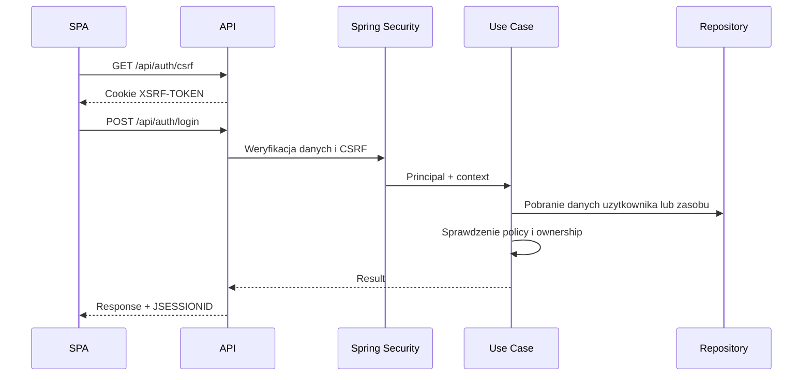

# Uwierzytelnianie i Autoryzacja

## Cel dokumentu
Opisuje aktualny i docelowy model tozsamosci uzytkownika, sesji oraz reguly autoryzacji na poziomie API i logiki biznesowej.

## Status dokumentu
- Status: draft
- Zakres: authN i authZ dla stanu obecnego i docelowego
- Ostatnia aktualizacja: 2026-07-13

## Stan obecny
- Backend korzysta ze Spring Security oraz sesji serwerowej opartej o cookie `JSESSIONID`.
- SPA korzysta z ochrony CSRF i pobiera token przez `GET /api/auth/csrf`, a backend wystawia cookie `XSRF-TOKEN`.
- Dostepne sa endpointy `POST /api/auth/register`, `POST /api/auth/login`, `POST /api/auth/logout`, `GET /api/auth/me` oraz `GET /api/auth/csrf`.
- `POST /api/auth/register` nie jest publicznym signupem. Konto moze utworzyc tylko zalogowany administrator.
- Pelny zestaw Flyway V1-V5 nie pozostawia aktywnego developerskiego administratora: V5 usuwa historyczny seed albo blokuje jego znany credential, jezeli konto ma zalezne dane. Pierwszy administrator powstaje lub jest bezpiecznie aktywowany przez jawnie wlaczany bootstrap runtime, ktory nie resetuje hasla zwyklego admina przy replay, nie podnosi roli istniejacego konta i zapisuje wymagany `ADMIN_BOOTSTRAPPED` w tej samej transakcji.
- Aktualnie zaimplementowane role systemowe w kodzie to `ADMIN` i `USER`.
- Podstawowy audyt zapisuje wpisy do tabeli `audit_events` przez `AuditService`.
- Etap 3 egzekwuje role kontekstowe `OWNER`/`MANAGER`, ownership wydarzenia i aktywne membership w use case oraz scoped queries.
- Mutacje `/api/events/**` korzystaja z tej samej ochrony sesji i CSRF co pozostale prywatne API.
- Logowanie zlicza nieudane proby dla istniejacego konta i czasowo blokuje konto po przekroczeniu limitu.
- Aktualnie zaimplementowane eventy audytowe identity to `ADMIN_BOOTSTRAPPED`, `USER_REGISTERED`, `USER_LOGGED_IN`, `USER_LOGIN_FAILED`, `USER_LOGIN_BLOCKED` oraz `USER_LOGGED_OUT`.
- Audyt domenowy obejmuje takze `EVENT_CREATED`, `EVENT_UPDATED`, `EVENT_ARCHIVED`, `EVENT_DELETED`, `EVENT_MANAGER_ADDED`, `EVENT_MANAGER_REMOVED` i `EVENT_OWNERSHIP_TRANSFERRED`.
- Konta demo do recznego klikania sa tworzone przez migracje Flyway V7-V9: `admin@example.com`, `owner@example.com`, `manager@example.com` i `guest-tester@example.com` maja wspolne haslo demo opisane w [../operations/CONFIGURATION.md](../operations/CONFIGURATION.md).

## Stan docelowy
- Bezpieczny system uwierzytelniania uzytkownikow oraz oddzielny model dostepu gosci do galerii.
- Pelny zestaw flow identity ma obejmowac takze weryfikacje e-mail, reset hasla, wylogowanie, zarzadzanie sesjami i rozszerzony audyt.

## Aktualny kontrakt auth
- `GET /api/auth/csrf` - przygotowanie tokenu CSRF dla klienta SPA.
- `POST /api/auth/login` - logowanie uzytkownika do sesji.
- `POST /api/auth/logout` - zakonczenie aktualnej sesji.
- `GET /api/auth/me` - odczyt tozsamosci aktualnie zalogowanego uzytkownika.
- `POST /api/auth/register` - utworzenie nowego konta przez administratora.

SSOT kontraktu FE-BE znajduje sie w [../../api-contract/API_CONTRACT.md](../../api-contract/API_CONTRACT.md).

## Zakres docelowego uwierzytelniania
- Administracyjne tworzenie kont i dalsze zarzadzanie tozsamoscia.
- Logowanie i wylogowanie.
- Weryfikacja e-mail.
- Reset i zmiana hasla.
- Zarzadzanie sesjami uzytkownika.
- Tokeny publicznego dostepu do galerii i pobran.

## Wymagania funkcjonalne
- Hasla musza byc bezpiecznie hashowane.
- Tokeny jednorazowe musza byc silne i losowe.
- Flow oparty o sesje cookie musi pozostac zgodny z CSRF dla SPA.
- Produkcja wymaga `Secure`, `HttpOnly` i `SameSite=Lax` dla sesji oraz `Secure` i `SameSite=Lax` dla cookie CSRF.
- Rozszerzenia auth musza utrzymywac rozroznienie miedzy administracyjnym tworzeniem kont a publicznym dostepem gosci do galerii.

## Autoryzacja systemowa
- Aktualnie zaimplementowane role systemowe: `ADMIN`, `USER`.
- Docelowy model ról i uprawnien moze zostac rozszerzony, ale dokumentacja nie moze sugerowac istnienia ról, ktorych nie ma jeszcze w kodzie.
- Uprawnienia wynikaja z polaczenia roli systemowej, relacji do wydarzenia i ownership zasobow.
- W `/api/events` rola `ADMIN` nie zastepuje ownership; przyszle operacje administratora wymagaja osobnego toru.

## Autoryzacja publiczna
- Publiczny dostep do galerii nie daje roli systemowej.
- Gosc dziala w osobnym kontekscie dostepu do galerii.
- Upload, podglad i pobieranie zalezy od ustawien galerii oraz tokenu lub kodu dostepu.

## Poziomy kontroli
- Endpoint: uwierzytelnienie, rola systemowa, podstawowe ograniczenia.
- Use case: ownership, membership, plan, status zasobu.
- Repozytorium: brak zalozenia, ze sam identyfikator zasobu jest wystarczajacy.

## Audyt zdarzen auth
- Wazne operacje identity musza zapisywac biznesowy slad audytowy przez `AuditService`.
- Aktualna tabela audytu to `audit_events`, a model kodowy to `AuditEvent`.
- Obecny katalog eventow obejmuje:
  - `USER_REGISTERED`
  - `USER_LOGGED_IN`
  - `USER_LOGIN_FAILED`
  - `USER_LOGIN_BLOCKED`
  - `USER_LOGGED_OUT`
- Kazda nowa wrazliwa akcja w obszarze auth lub administracji musi przejsc przeglad pod katem:
  - czy trzeba dodac nowy typ do `EventType`,
  - czy trzeba rozszerzyc szczegoly wpisu audytowego,
  - czy dokumentacja i testy odzwierciedlaja nowy slad audytowy.
- W audycie nie wolno zapisywac hasel, tokenow, surowych danych CSRF ani innych sekretow.

## Przeplyw autoryzacji

## Co zostalo do zrobienia
- Ewentualne zarzadzanie wieloma sesjami i logout-all jako rozszerzenie ponad podstawowa identity.
- Weryfikacja e-mail i reset hasla wraz z obsluga maili transakcyjnych w kolejnym zakresie identity.
- Rate limiting na poziomie infrastrukturalnym lub aplikacyjnym jako dodatkowa warstwa ochrony.
- Rozszerzenie audytu o zmiany rol i akcje administracyjne poza biezacym zakresem auth.

## Powiazane dokumenty
- [../product/PERMISSIONS_MATRIX.md](../product/PERMISSIONS_MATRIX.md)
- [../operations/LOGGING.md](../operations/LOGGING.md)
- [../security/SECURITY_REQUIREMENTS.md](../security/SECURITY_REQUIREMENTS.md)
- [../adr/0002-authentication-strategy.md](../adr/0002-authentication-strategy.md)

## Decyzje otwarte
- Jak szeroki ma byc katalog eventow audytowych w pierwszym zamknietym zakresie Etapu 2.
- Czy po wdrozeniu pelnego logoutu potrzebny bedzie osobny model uniewazniania wszystkich sesji.
