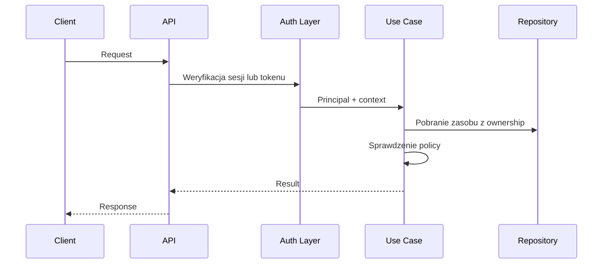

# Uwierzytelnianie i Autoryzacja

## Cel dokumentu
Opisuje docelowy model tożsamości użytkownika, sesji oraz reguł autoryzacji na poziomie API i logiki biznesowej.

## Status dokumentu
- Status: draft
- Zakres: authN i authZ dla stanu docelowego
- Ostatnia aktualizacja: 2026-07-12

## Stan obecny
- Strategia końcowa nie została jeszcze zatwierdzona.

## Stan docelowy
- Bezpieczny system uwierzytelniania użytkowników i oddzielny model dostępu gości do galerii.

## Zakres uwierzytelniania
- Rejestracja użytkownika
- Weryfikacja e-mail
- Logowanie i wylogowanie
- Reset i zmiana hasła
- Sesje użytkownika oraz ewentualne odświeżanie
- Tokeny publicznego dostępu do galerii i pobrań

## Wymagania funkcjonalne
- Hashowanie haseł Argon2id lub BCrypt.
- Silne, losowe tokeny jednokrotnego użycia.
- Blokada po wielu nieudanych logowaniach.
- Możliwość unieważnienia pojedynczej sesji i wszystkich sesji użytkownika.

## Autoryzacja systemowa
- Role systemowe: `USER`, `SYSTEM_ADMINISTRATOR`, `SUPER_ADMINISTRATOR`.
- Role wydarzenia: `EVENT_OWNER`, `EVENT_MANAGER`.
- Uprawnienia wynikają z połączenia roli systemowej, relacji do wydarzenia i ownership.

## Autoryzacja publiczna
- Publiczny dostęp nie daje roli systemowej.
- Gość działa w kontekście `GalleryAccess`.
- Upload, podgląd i pobieranie zależą od ustawień galerii oraz tokenu lub kodu dostępu.

## Poziomy kontroli
- Endpoint: uwierzytelnienie, rola systemowa, podstawowe ograniczenia.
- Use case: ownership, membership, plan, status zasobu.
- Repozytorium: brak zakładania, że sam identyfikator zasobu jest wystarczający.

## Przepływ autoryzacji

## Rekomendacja robocza
- Rekomendacja na dziś: sesja HTTP po stronie serwera lub model tokenów sesyjnych przechowywanych serwerowo, ze względu na prostsze unieważnianie, CSRF-aware flow i administracyjne zarządzanie sesjami.
- Ostateczna decyzja wymaga zatwierdzenia ADR.

## Powiązane dokumenty
- [../product/PERMISSIONS_MATRIX.md](../product/PERMISSIONS_MATRIX.md)
- [../architecture/MULTI_TENANCY.md](../architecture/MULTI_TENANCY.md)
- [../adr/0002-authentication-strategy.md](../adr/0002-authentication-strategy.md)

## Decyzje otwarte
- Finalny wybór: sesja serwerowa vs JWT.
- Czy gość ma otrzymywać długowieczny cookie galerii po jednorazowym wpisaniu kodu dostępu.
