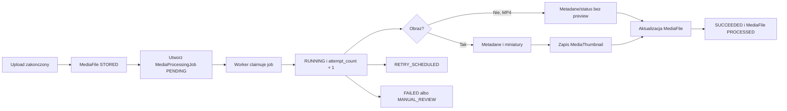

# Przetwarzanie Mediow

## Cel dokumentu
Opisuje pipeline przetwarzania zdjec i filmow po uploadzie.

## Status dokumentu
- Status: draft
- Zakres: miniatury, metadane, retry i bledy
- Ostatnia aktualizacja: 2026-07-21

## Stan obecny
- Pierwsza iteracja pipeline'u jest zaimplementowana.
- Etap 5 zapisuje oryginaly przez `StorageService`, a po udanym zapisie Etap 6 tworzy trwaly `MediaProcessingJob`.
- Worker in-process claimuje joby, aktualizuje status pliku i zapisuje `MediaThumbnail` dla wariantu `SMALL`.

## Stan docelowy
- Asynchroniczne, odporne na bledy przetwarzanie mediow z zachowaniem oryginalow.

## Zakres Etapu 6
- Utworzenie trwalego joba po udanym zapisie oryginalu.
- Ekstrakcja podstawowych metadanych technicznych: szerokosc/wysokosc dla obrazow.
- Generowanie wariantu obrazu `SMALL` dla formatow obslugiwanych przez runtime `ImageIO`; bazowo gwarantowane sa JPEG/PNG, a WebP wymaga providera `ImageIO`.
- Zapis statusu processingu, liczby prob oraz przewidywalnych kodow bledow.
- Retry automatyczny dla bledow przejsciowych i status po wyczerpaniu prob.
- Idempotentny worker: ponowne wykonanie nie duplikuje miniaturek ani nie psuje oryginalu.

## Poza zakresem Etapu 6
- Publiczne listowanie mediow, lightbox, download, streaming i signed links.
- Pelne transkodowanie wideo oraz generowanie preview MP4.
- Moderacja, publikacja i bulk actions.
- Skan antywirusowy jako pelny system; analiza kodeka MP4 moze pozostac twardym hardeningiem, jesli nie wymaga nowej infrastruktury.

## Przeplyw

## Statusy joba
- `PENDING`
- `RUNNING`
- `SUCCEEDED`
- `FAILED`
- `RETRY_SCHEDULED`
- `MANUAL_REVIEW`

## Statusy pliku po Etapie 6
Aktualne statusy uploadu pozostaja potrzebne dla przyjecia pliku:
- `PENDING`
- `RECEIVING`
- `STORED`
- `FAILED`
- `CANCELLED`
- `CLEANUP_REQUIRED`

Etap 6 dodaje statusy processingu bez mieszania ich z publiczna moderacja:
- `PROCESSING`
- `PROCESSED`
- `PROCESSING_FAILED`

## Zasady jakosci
- Oryginalny plik jest zawsze zachowywany.
- Blad miniatury nie oznacza utraty oryginalu.
- Nieobslugiwany format powinien byc odrzucony w uploadzie albo zakonczony przewidywalnym kodem bledu processingu.
- Worker nie wykonuje kosztownych operacji w watku requestu.
- Logi i bledy nie zawieraja fizycznych sciezek storage, tokenow, kodow dostepu ani prywatnych linkow.
- `MEDIA_STORED` pozostaje wymaganym audytem zapisu oryginalu, a worker zapisuje systemowe eventy
  `MEDIA_PROCESSING_SUCCEEDED` i `MEDIA_PROCESSING_FAILED` dla terminalnego wyniku processingu.
- Przejsciowe retry jest logowane technicznie, ale nie tworzy osobnego audit eventu, zeby audyt pokazywal wynik dzialania zamiast kazdej proby wykonania.
- Job i wariant thumbnaila musza byc idempotentne wzgledem `(media_file_id, job_type)` i `(media_file_id, variant)`.

## Powiazane dokumenty
- [../architecture/BACKGROUND_JOBS.md](../architecture/BACKGROUND_JOBS.md)
- [../security/FILE_UPLOAD_SECURITY.md](../security/FILE_UPLOAD_SECURITY.md)
- [../adr/0004-media-processing-strategy.md](../adr/0004-media-processing-strategy.md)
- [../adr/0007-background-jobs.md](../adr/0007-background-jobs.md)

## Decyzje otwarte
- Konkretne rozmiary wariantow miniaturek nalezy zamrozic w kontrakcie Etapu 6 przed implementacja UI listowania w Etapie 7.
- Czy dodac zaleznosc/providera WebP do gwarantowanego processingu WebP, czy pozostawic WebP jako upload-only do czasu Etapu 7.
