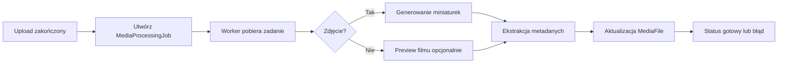

# Przetwarzanie Mediów

## Cel dokumentu
Opisuje docelowy pipeline przetwarzania zdjęć i filmów po uploadzie.

## Status dokumentu
- Status: draft
- Zakres: miniatury, metadane, retry i błędy
- Ostatnia aktualizacja: 2026-07-12

## Stan obecny
- Pipeline przetwarzania nie jest jeszcze zaimplementowany.

## Stan docelowy
- Asynchroniczne, odporne na błędy przetwarzanie mediów z zachowaniem oryginałów.

## Zakres
- Korekta orientacji obrazu
- Generowanie miniaturek zdjęć
- Generowanie podglądów filmów opcjonalnie
- Ekstrakcja podstawowych metadanych technicznych
- Ograniczenie rozdzielczości preview
- Zapis statusu przetwarzania i błędów

## Przepływ

## Statusy
- `PENDING`
- `RUNNING`
- `SUCCEEDED`
- `FAILED`
- `RETRY_SCHEDULED`

## Zasady jakości
- Oryginalny plik jest zawsze zachowywany.
- Błąd miniatury nie powinien oznaczać utraty oryginału.
- Nieobsługiwany format powinien być odrzucony wcześniej lub oznaczony przewidywalnym błędem.

## Powiązane dokumenty
- [../architecture/BACKGROUND_JOBS.md](../architecture/BACKGROUND_JOBS.md)
- [../security/FILE_UPLOAD_SECURITY.md](../security/FILE_UPLOAD_SECURITY.md)
- [../adr/0004-media-processing-strategy.md](../adr/0004-media-processing-strategy.md)

## Decyzje otwarte
- Czy generować preview dla filmów w pierwszej fazie, czy odłożyć tę funkcję za feature flagę.
