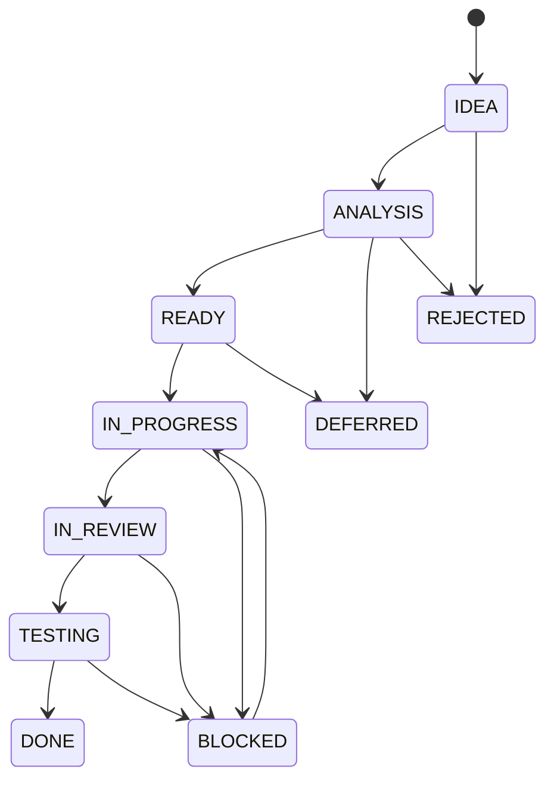

# Lifecycle Funkcji

## Cel dokumentu
Opisuje statusy funkcji i warunki przechodzenia między nimi.

## Status dokumentu
- Status: draft
- Zakres: lifecycle funkcji i zadań produktowych
- Ostatnia aktualizacja: 2026-07-12

## Stan obecny
- Statusy są zdefiniowane dokumentacyjnie, ale nie są jeszcze wymuszane przez narzędzia.

## Stan docelowy
- Każda funkcja ma jednoznaczny status oraz wymagane artefakty do przejścia dalej.

## Diagram stanów

## Statusy
### IDEA
- Znaczenie: pomysł lub potrzeba biznesowa bez pełnej analizy.
- Wymagane wejścia: wstępny opis problemu.
- Warunki przejścia dalej: identyfikacja celu i właściciela analizy.
- Odpowiedzialność: product owner, architekt lub osoba zgłaszająca.
- Wymagane dokumenty: backlog lub notatka inicjująca.

### ANALYSIS
- Znaczenie: trwa analiza wpływu i zakresu.
- Wymagane wejścia: opis celu, kontekst domenowy, wstępne zależności.
- Warunki przejścia dalej: spełnione [DEFINITION_OF_READY.md](DEFINITION_OF_READY.md), znane ryzyka, określony zakres.
- Odpowiedzialność: autor analizy, agent AI lub programista.
- Wymagane dokumenty: backlog, powiązane dokumenty domenowe, ADR jeśli potrzebny.

### READY
- Znaczenie: zadanie gotowe do realizacji.
- Wymagane wejścia: pełny opis zadania, kryteria akceptacji, plan testów.
- Warunki przejścia dalej: przyjęcie przez wykonawcę i rozpoczęcie prac.
- Odpowiedzialność: właściciel zadania i wykonawca.
- Wymagane dokumenty: task template, Definition of Ready, backlog.

### IN_PROGRESS
- Znaczenie: trwa realizacja.
- Wymagane wejścia: zaakceptowany zakres i plan.
- Warunki przejścia dalej: implementacja minimalnego spójnego zakresu oraz lokalna weryfikacja.
- Odpowiedzialność: programista lub agent AI.
- Wymagane dokumenty: plan, checklisty, dokumenty domenowe.

### IN_REVIEW
- Znaczenie: zmiana oczekuje na review.
- Wymagane wejścia: gotowy diff, opis zmian, wyniki testów.
- Warunki przejścia dalej: zakończony code review, brak blockerów.
- Odpowiedzialność: reviewer i autor.
- Wymagane dokumenty: checklisty review, DoD, ewentualny ADR.

### TESTING
- Znaczenie: trwa weryfikacja funkcjonalna i regresyjna.
- Wymagane wejścia: zmiana po review.
- Warunki przejścia dalej: przejście wymaganych testów i smoke testów.
- Odpowiedzialność: autor, tester lub agent wykonujący testy.
- Wymagane dokumenty: strategia testów, scenariusze E2E, checklisty.

### BLOCKED
- Znaczenie: zadanie nie może iść dalej z powodu blokera.
- Wymagane wejścia: opis blokera.
- Warunki przejścia dalej: usunięcie blokera lub decyzja o defer.
- Odpowiedzialność: autor zadania i właściciel decyzji.
- Wymagane dokumenty: notatka blokera, ewentualny ADR.

### DONE
- Znaczenie: zakres został ukończony zgodnie z DoD.
- Wymagane wejścia: komplet implementacji, testów i dokumentacji.
- Warunki przejścia dalej: brak, stan końcowy.
- Odpowiedzialność: autor i reviewer potwierdzający zakończenie.
- Wymagane dokumenty: [../DEFINITION_OF_DONE.md](../DEFINITION_OF_DONE.md), zaktualizowana dokumentacja.

### DEFERRED
- Znaczenie: zadanie celowo odłożone bez odrzucenia.
- Wymagane wejścia: uzasadnienie odłożenia.
- Warunki przejścia dalej: ponowne wejście do analizy lub ready.
- Odpowiedzialność: właściciel backlogu.
- Wymagane dokumenty: backlog i notatka o powodach odłożenia.

### REJECTED
- Znaczenie: zadanie odrzucone.
- Wymagane wejścia: uzasadnienie biznesowe lub techniczne.
- Warunki przejścia dalej: brak, chyba że powstanie nowe zadanie.
- Odpowiedzialność: właściciel backlogu lub architekt.
- Wymagane dokumenty: backlog i zapis decyzji.

## Powiązane dokumenty
- [WORKFLOW.md](WORKFLOW.md)
- [DEFINITION_OF_READY.md](DEFINITION_OF_READY.md)
- [../DEFINITION_OF_DONE.md](../DEFINITION_OF_DONE.md)

## Decyzje otwarte
- Czy status `TESTING` ma być odrębny w każdym zadaniu czy tylko dla większych zmian.
