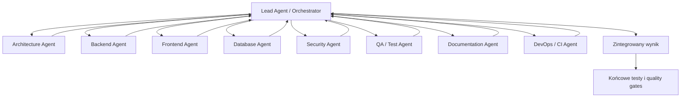

# Orkiestracja Subagentów

## Cel dokumentu
Opisuje standard wykorzystywania subagentów podczas pracy nad projektem.

## Status dokumentu
- Status: draft
- Zakres: role subagentów, kontrakt zadania, praca równoległa i integracja wyników
- Ostatnia aktualizacja: 2026-07-12

## Stan obecny
- Projekt ma dokumentację i lokalne skills, ale orkiestracja subagentów nie jest jeszcze sformalizowana narzędziowo.
- Subagenci mogą być używani do analizy, review, planowania lub niezależnych zadań, jeśli narzędzia w danym środowisku to umożliwiają.

## Stan docelowy
- Lead Agent świadomie dobiera tylko potrzebne role, przekazuje im ograniczony zakres i integruje wyniki.
- Subagenci wspierają jakość analizy, ale nie przejmują odpowiedzialności za całość zadania.

## Zasada nadrzędna
Lead Agent / Orchestrator jest właścicielem całości zadania. Wynik subagenta jest rekomendacją, dopóki Lead Agent go nie zatwierdzi, nie rozwiąże sprzeczności i nie zintegruje zmian.

## Role subagentów

### Lead Agent / Orchestrator
Odpowiada za:
- zrozumienie zadania,
- wybór potrzebnych subagentów,
- podział pracy,
- przekazanie każdemu agentowi jasno określonego zakresu,
- pilnowanie zależności,
- zebranie rezultatów,
- wykrycie sprzeczności,
- podjęcie decyzji integracyjnych,
- wykonanie lub zlecenie implementacji,
- końcową weryfikację,
- przygotowanie podsumowania.

Lead Agent nie powinien delegować odpowiedzialności za finalny wynik. To on decyduje, które rekomendacje przyjąć, które odrzucić i jakie testy końcowe uruchomić.

### Architecture Agent
Odpowiada za:
- analizę wpływu zadania na architekturę,
- sprawdzenie modularnego monolitu,
- granice modułów,
- zależności między domenami,
- zgodność z ADR,
- wykrycie potrzeby utworzenia nowego ADR,
- unikanie nadmiernej złożoności.

Nie implementuje kodu, jeśli nie otrzyma takiego zadania. Jego podstawowym wynikiem jest analiza wpływu, ryzyka i rekomendacje architektoniczne.

### Backend Agent
Odpowiada za:
- domenę backendową,
- przypadki użycia,
- API,
- DTO,
- walidację,
- transakcje,
- autoryzację,
- ownership,
- obsługę błędów,
- logowanie,
- testy backendu.

### Frontend Agent
Odpowiada za:
- flow użytkownika,
- routing,
- komponenty,
- warstwę API,
- mobile-first,
- responsywność,
- accessibility,
- loading, error i empty states,
- testy frontendu.

### Database Agent
Odpowiada za:
- model danych,
- relacje,
- constraints,
- indeksy,
- migracje Flyway,
- kompatybilność danych,
- wydajność zapytań,
- strategię soft delete,
- testy migracji.

### Security Agent
Odpowiada za:
- authentication,
- authorization,
- ownership,
- IDOR,
- CSRF,
- CORS,
- XSS,
- SQL injection,
- rate limiting,
- upload security,
- storage security,
- sekrety,
- logowanie danych wrażliwych,
- działania administratora.

### QA / Test Agent
Odpowiada za:
- kryteria akceptacji,
- przypadki pozytywne,
- przypadki negatywne,
- przypadki brzegowe,
- regresję,
- testy jednostkowe,
- integracyjne,
- frontendowe,
- E2E,
- ryzyka jakościowe.

### Documentation Agent
Odpowiada za:
- sprawdzenie zgodności kodu z dokumentacją,
- aktualizację dokumentów domenowych,
- aktualizację API,
- aktualizację modelu danych,
- aktualizację roadmapy,
- aktualizację ADR,
- wykrywanie duplikacji i sprzeczności.

### DevOps / CI Agent
Odpowiada za:
- analizę wpływu na pipeline,
- build,
- testy,
- obrazy Docker,
- migracje,
- deployment,
- rollback,
- health checks,
- sekrety CI,
- cache zależności,
- artefakty,
- wersjonowanie.

## Kiedy uruchamiać subagentów
Lead Agent nie powinien uruchamiać wszystkich agentów dla każdego zadania. Dobór ról zależy od ryzyka, złożoności i obszaru zmiany.

Przykłady:

| Typ zadania | Typowe role |
| --- | --- |
| Zmiana tekstu w UI | Frontend Agent, ewentualnie QA Agent |
| Nowy endpoint | Backend Agent, Security Agent, QA Agent |
| Zmiana tabeli | Database Agent, Backend Agent, QA Agent |
| Upload plików | Architecture Agent, Backend Agent, Frontend Agent, Security Agent, QA Agent, DevOps Agent |
| Zmiana deploymentu | DevOps Agent, Security Agent, QA Agent |

Nie uruchamiaj subagenta tylko po to, żeby potwierdził oczywisty krok. Używaj subagentów tam, gdzie niezależna analiza realnie zmniejsza ryzyko lub przyspiesza pracę.

## Zasady pracy równoległej
- Równolegle wykonuj przede wszystkim niezależne analizy.
- Nie pozwalaj kilku agentom modyfikować tych samych plików.
- Niezależne implementacje powinny korzystać z osobnych branchy lub worktree.
- Każdy subagent musi otrzymać jasno zdefiniowany zakres.
- Każdy subagent musi wskazać założenia, ryzyka i nieweryfikowane obszary.
- Agent nie może samodzielnie rozszerzać zakresu.
- Lead Agent odpowiada za rozwiązanie sprzecznych rekomendacji.
- Wynik subagenta jest rekomendacją, dopóki Lead Agent go nie zatwierdzi.
- Końcowe testy integracyjne muszą być wykonane po scaleniu zmian.

## Konflikty plików
Przed uruchomieniem subagentów Lead Agent powinien określić:
- które pliki są tylko do analizy,
- które pliki mogą być modyfikowane,
- których plików nie wolno dotykać,
- czy subagent może tworzyć nowe pliki,
- czy potrzebny jest osobny branch albo worktree.

Jeśli dwa subagenty muszą pracować na tym samym pliku, lepiej rozdzielić ich zadania na analizę i jedną kontrolowaną implementację wykonywaną przez Lead Agenta.

## Kontrakt zadania subagenta
Każde polecenie dla subagenta powinno zawierać:
- rolę,
- cel,
- kontekst,
- dokładny zakres,
- elementy poza zakresem,
- dokumenty do przeczytania,
- pliki, które może analizować,
- pliki, które może modyfikować,
- oczekiwany format wyniku,
- wymagane testy,
- warunki zakończenia.

Minimalny szablon:

```md
Rola: [Architecture / Backend / Frontend / Database / Security / QA / Documentation / DevOps]
Cel: [konkretny wynik]
Kontekst: [zadanie, dokumenty, decyzje, ograniczenia]
Zakres: [co wolno analizować lub zmienić]
Poza zakresem: [czego nie robić]
Dokumenty do przeczytania: [...]
Pliki do analizy: [...]
Pliki do modyfikacji: [...]
Oczekiwany wynik: [format]
Testy: [co uruchomić lub zaproponować]
Warunki zakończenia: [kiedy uznać pracę za gotową]
```

## Format wyniku subagenta
Każdy subagent powinien zwrócić:
1. Podsumowanie analizy.
2. Wykryte problemy.
3. Rekomendowane zmiany.
4. Pliki objęte zmianą.
5. Wpływ na bezpieczeństwo.
6. Wpływ na testy.
7. Ryzyka.
8. Nierozstrzygnięte decyzje.
9. Wyniki uruchomionych komend lub testów.
10. Jasną informację, czego nie udało się zweryfikować.

## Integracja wyników
Lead Agent po zebraniu wyników:
1. Porównuje rekomendacje z dokumentacją i ADR.
2. Wykrywa sprzeczności między subagentami.
3. Wybiera najprostsze rozwiązanie zgodne z architekturą.
4. Odrzuca rozszerzenia zakresu bez podstawy w zadaniu.
5. Łączy zmiany w jeden spójny plan lub patch.
6. Uruchamia końcowe testy po integracji.
7. Dokumentuje, czego nie udało się zweryfikować.

## Diagram


## Powiązane dokumenty
- [WORKFLOW.md](WORKFLOW.md)
- [AI_TASK_PLANNING.md](AI_TASK_PLANNING.md)
- [DEFINITION_OF_READY.md](DEFINITION_OF_READY.md)
- [../DEFINITION_OF_DONE.md](../DEFINITION_OF_DONE.md)
- [../operations/CI_CD_STRATEGY.md](../operations/CI_CD_STRATEGY.md)
- [../../.agents/skills/task-orchestration/SKILL.md](../../.agents/skills/task-orchestration/SKILL.md)

## Decyzje otwarte
- Czy wyniki subagentów mają być zapisywane jako trwałe artefakty w repozytorium, czy tylko w konwersacji i PR.
