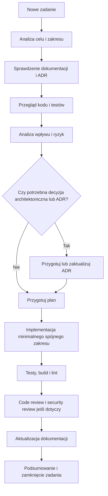

# Workflow Rozwoju

## Cel dokumentu
Opisuje standardowy proces realizacji każdej funkcji, poprawki lub zmiany architektonicznej w projekcie.

## Status dokumentu
- Status: draft
- Zakres: workflow dla agentów AI i programistów
- Ostatnia aktualizacja: 2026-07-12

## Stan obecny
- Proces jest definiowany dokumentacyjnie i nie jest jeszcze w pełni zautomatyzowany narzędziowo.

## Stan docelowy
- Każda zmiana przechodzi przez ten sam przewidywalny workflow, z jasnym miejscem na analizę, implementację, testy, review i aktualizację dokumentacji.

## Zasady ogólne
- Nie zaczynaj implementacji, jeśli zadanie wymaga wcześniejszej decyzji architektonicznej, bezpieczeństwa lub modelu danych.
- Nie zakładaj, że opisane funkcje już istnieją w kodzie.
- Wykonuj minimalny spójny zakres zamiast szerokiej, niesprawdzonej zmiany.
- Aktualizacja dokumentacji jest częścią zadania, a nie etapem opcjonalnym.

## Standardowy przebieg zadania
1. Analiza zadania.
2. Sprawdzenie dokumentacji.
3. Sprawdzenie aktualnego kodu.
4. Identyfikacja modułów i plików objętych zmianą.
5. Analiza wpływu na model danych, migracje, API, backend, frontend, bezpieczeństwo, autoryzację, ownership, testy, storage, limity, monitoring i dokumentację.
6. Przygotowanie krótkiego planu.
7. Identyfikacja wymaganych ADR-ów.
8. Implementacja minimalnego spójnego zakresu.
9. Dodanie lub aktualizacja testów.
10. Uruchomienie builda, testów i lintowania.
11. Code review.
12. Security review, jeśli zmiana dotyczy danych, uploadu, autoryzacji lub panelu administratora.
13. Aktualizacja dokumentacji.
14. Podsumowanie wykonanych zmian.

## Kontrola przed implementacją
- Sprawdź [DEFINITION_OF_READY.md](DEFINITION_OF_READY.md).
- Sprawdź [../product/BACKLOG.md](../product/BACKLOG.md) i powiązane epiki.
- Sprawdź odpowiednie ADR-y.
- Zidentyfikuj czy zmiana wymaga nowego ADR lub aktualizacji istniejącego.

## Analiza wpływu
Przed implementacją należy jawnie odpowiedzieć:
- Czy zmienia się model danych lub migracje?
- Czy zmienia się kontrakt API?
- Czy frontend wymaga nowych widoków, stanów loading/error/empty lub guardów?
- Czy zmiana wpływa na ownership, role albo dostęp publiczny?
- Czy zmiana wpływa na limity, storage, retencję lub backup?
- Czy trzeba dodać monitoring, logowanie albo audyt?
- Czy trzeba zmienić dokumentację domenową, checklisty lub prompt templates?

## Diagram przepływu

## Role i odpowiedzialności
- Autor zmiany: analiza, implementacja, testy, dokumentacja.
- Reviewer: poprawność, architektura, bezpieczeństwo, zakres, jakość.
- Agent AI: przygotowanie planu, wykonanie minimalnego zakresu, wskazanie braków i niezweryfikowanych obszarów.
- Właściciel decyzji architektonicznej: zatwierdzenie ADR i zmian wpływających na fundamenty systemu.

## Powiązane dokumenty
- [FEATURE_LIFECYCLE.md](FEATURE_LIFECYCLE.md)
- [DEFINITION_OF_READY.md](DEFINITION_OF_READY.md)
- [../DEFINITION_OF_DONE.md](../DEFINITION_OF_DONE.md)
- [../checklists/FEATURE_CHECKLIST.md](../checklists/FEATURE_CHECKLIST.md)

## Decyzje otwarte
- Czy security review będzie obowiązkowe dla wszystkich zmian publicznego API czy tylko dla wybranych kategorii.
