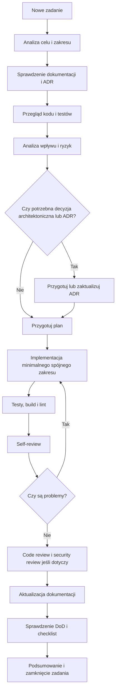

# Workflow Rozwoju

## Cel dokumentu
Opisuje standardowy proces realizacji każdej funkcji, poprawki lub zmiany architektonicznej w projekcie.

## Status dokumentu
- Status: draft
- Zakres: workflow dla agentów AI i programistów
- Ostatnia aktualizacja: 2026-07-12

## Stan obecny
- Proces jest definiowany dokumentacyjnie i nie jest jeszcze w pełni zautomatyzowany narzędziowo.

## Stan docelowy
- Każda zmiana przechodzi przez ten sam przewidywalny workflow, z jasnym miejscem na analizę, implementację, testy, review i aktualizację dokumentacji.

## Zasady ogólne
- Nie zaczynaj implementacji, jeśli zadanie wymaga wcześniejszej decyzji architektonicznej, bezpieczeństwa lub modelu danych.
- Nie zakładaj, że opisane funkcje już istnieją w kodzie.
- Wykonuj minimalny spójny zakres zamiast szerokiej, niesprawdzonej zmiany.
- Aktualizacja dokumentacji jest częścią zadania, a nie etapem opcjonalnym.
- Decyzja o użyciu albo nieużyciu subagentów musi być jawna dla każdego zadania nietrywialnego.
- Self-review po implementacji jest obowiązkowy i ma być wykonany z perspektywy review, nie autora.
- Workflow jest pętlą: jeśli testy, review albo checklista wykryją problem, zadanie wraca do implementacji aż do domknięcia albo jawnego opisania blokera.
- Zamknięcie zadania wymaga sprawdzenia spełnienia wymagań, DoD i właściwych checklist punkt po punkcie.

## Standardowy przebieg zadania
1. Analiza zadania.
2. Sprawdzenie dokumentacji.
3. Sprawdzenie aktualnego kodu.
4. Identyfikacja modułów i plików objętych zmianą.
5. Analiza wpływu na model danych, migracje, API, backend, frontend, bezpieczeństwo, autoryzację, ownership, testy, storage, limity, monitoring i dokumentację.
6. Przygotowanie krótkiego planu.
7. Decyzja, czy zadanie wymaga orkiestracji subagentów zgodnie z [SUBAGENT_ORCHESTRATION.md](SUBAGENT_ORCHESTRATION.md).
8. Identyfikacja wymaganych ADR-ów.
9. Implementacja minimalnego spójnego zakresu.
10. Dodanie lub aktualizacja testów opartych na wymaganiach, kontrakcie i ryzykach.
11. Uruchomienie builda, testów i lintowania.
12. Self-review w świeżym kontekście.
13. Poprawa problemów wykrytych przez testy albo self-review.
14. Ponowne uruchomienie kontroli aż wynik będzie zielony albo blocker będzie jasno opisany.
15. Code review.
16. Security review, jeśli zmiana dotyczy danych, uploadu, autoryzacji lub panelu administratora.
17. Aktualizacja dokumentacji.
18. Końcowe sprawdzenie DoD i checklist.
19. Podsumowanie wykonanych zmian.

## Kontrola przed implementacją
- Sprawdź [DEFINITION_OF_READY.md](DEFINITION_OF_READY.md).
- Sprawdź [../product/BACKLOG.md](../product/BACKLOG.md) i powiązane epiki.
- Sprawdź odpowiednie ADR-y.
- Zidentyfikuj czy zmiana wymaga nowego ADR lub aktualizacji istniejącego.

## Analiza wpływu
Przed implementacją należy jawnie odpowiedzieć:
- Czy zmienia się model danych lub migracje?
- Czy zmienia się kontrakt API?
- Czy frontend wymaga nowych widoków, stanów loading/error/empty lub guardów?
- Czy zmiana wpływa na ownership, role albo dostęp publiczny?
- Czy zmiana wpływa na limity, storage, retencję lub backup?
- Czy trzeba dodać monitoring, logowanie albo audyt?
- Czy trzeba zmienić dokumentację domenową, checklisty lub prompt templates?
- Czy zadanie wymaga subagentów, czy wystarczy jeden agent?
- Czy zmiana wpływa na CI/CD lub quality gates?
- Jakie testy najlepiej obalą błędną implementację, a nie tylko potwierdzą szczęśliwą ścieżkę?
- Jak zweryfikować zmianę po implementacji z perspektywy niezależnego review?

## Diagram przepływu

## Role i odpowiedzialności
- Autor zmiany: analiza, implementacja, testy, self-review, dokumentacja i końcowe sprawdzenie wymagań.
- Reviewer: poprawność, architektura, bezpieczeństwo, zakres, jakość.
- Agent AI: przygotowanie planu, jawna decyzja o subagentach, wykonanie minimalnego zakresu, wskazanie braków i niezweryfikowanych obszarów oraz iteracja aż do zielonego stanu albo jasno opisanego blokera.
- Właściciel decyzji architektonicznej: zatwierdzenie ADR i zmian wpływających na fundamenty systemu.

## Powiązane dokumenty
- [FEATURE_LIFECYCLE.md](FEATURE_LIFECYCLE.md)
- [DEFINITION_OF_READY.md](DEFINITION_OF_READY.md)
- [SUBAGENT_ORCHESTRATION.md](SUBAGENT_ORCHESTRATION.md)
- [../DEFINITION_OF_DONE.md](../DEFINITION_OF_DONE.md)
- [../checklists/FEATURE_CHECKLIST.md](../checklists/FEATURE_CHECKLIST.md)
- [../operations/CI_CD_STRATEGY.md](../operations/CI_CD_STRATEGY.md)

## Decyzje otwarte
- Czy security review będzie obowiązkowe dla wszystkich zmian publicznego API czy tylko dla wybranych kategorii.
