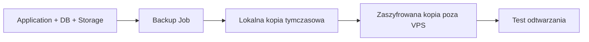

# Backup i Odtwarzanie

## Cel dokumentu
Opisuje strategię backupu, retencję, RPO/RTO i procedurę odtworzenia.

## Status dokumentu
- Status: draft
- Zakres: backup i disaster recovery
- Ostatnia aktualizacja: 2026-07-12

## Stan obecny
- Strategia backupu nie jest jeszcze wdrożona.

## Stan docelowy
- Regularne backupy PostgreSQL, storage i konfiguracji z testowanym odtwarzaniem.

## Zakres backupu
- PostgreSQL
- Storage plików
- Konfiguracja i sekrety przechowywane poza repozytorium
- Artefakty krytyczne dla odtworzenia środowiska

## Parametry
- RPO: do ustalenia, docelowo mierzone w godzinach
- RTO: do ustalenia, docelowo mierzone w godzinach
- Kopie przechowywane poza VPS
- Backup szyfrowany

## Diagram

## Odtwarzanie
- Przywrócenie bazy
- Przywrócenie storage
- Weryfikacja spójności metadanych i plików
- Test działania krytycznych ścieżek

## Powiązane dokumenty
- [DEPLOYMENT.md](DEPLOYMENT.md)
- [MAINTENANCE.md](MAINTENANCE.md)
- [../security/PRIVACY_AND_DATA_RETENTION.md](../security/PRIVACY_AND_DATA_RETENTION.md)

## Decyzje otwarte
- Docelowa częstotliwość pełnych kopii storage po zakończeniu wydarzenia.
