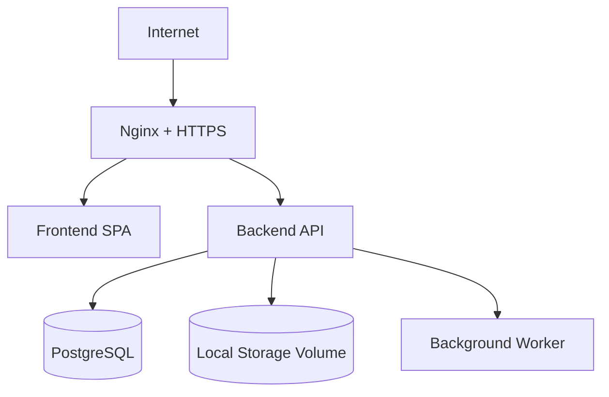

# Wdrożenie

## Cel dokumentu
Opisuje docelowy model wdrożenia platformy, z naciskiem na start na jednym VPS.

## Status dokumentu
- Status: draft
- Zakres: deployment model dla stanu docelowego
- Ostatnia aktualizacja: 2026-07-12

## Stan obecny
- Repozytorium zawiera szkice plików deploymentowych, ale nie stanowią one potwierdzonej konfiguracji produkcyjnej.

## Stan docelowy
- Jeden VPS z Nginx, frontendem, backendem, PostgreSQL, lokalnym storage i procesem zadań asynchronicznych.

## Architektura wdrożenia

## Wymagania
- Docker Compose dla środowisk lokalnych i produkcyjnych.
- HTTPS przez Let's Encrypt.
- Trwałe wolumeny dla bazy i storage.
- Health checks, readiness i liveness.
- Plan aktualizacji i rollbacku.
- Deployment powinien korzystać z artefaktów lub obrazów przechodzących quality gates opisane w [CI_CD_STRATEGY.md](CI_CD_STRATEGY.md).

## Powiązane dokumenty
- [ENVIRONMENTS.md](ENVIRONMENTS.md)
- [CONFIGURATION.md](CONFIGURATION.md)
- [CI_CD_STRATEGY.md](CI_CD_STRATEGY.md)
- [BACKUP_AND_RESTORE.md](BACKUP_AND_RESTORE.md)

## Decyzje otwarte
- Czy worker background jobs ma od początku działać jako osobny proces w compose produkcyjnym.
