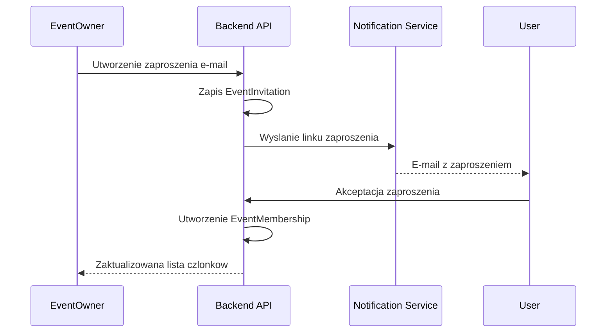

# Sciezki Uzytkownikow

## Cel dokumentu
Opisuje glowne przeplywy uzytkownikow dla stanu docelowego produktu.

## Status dokumentu
- Status: draft
- Zakres: kluczowe user journeys
- Ostatnia aktualizacja: 2026-07-13

## Stan obecny
- Sciezki opisane w tym dokumencie sa docelowe; tylko czesc flow identity jest juz zaimplementowana end-to-end.
- Aktualnie tworzenie kont odbywa sie administracyjnie, a nie przez publiczny signup.

## Stan docelowy
- Spojne przeplywy dla goscia, wlasciciela wydarzenia, wspolzarzadzajacego i administratora.

## Gosc przesyla zdjecia do galerii
1. Otwiera link lub skanuje kod QR.
2. Jesli galeria wymaga kodu, podaje kod dostepu.
3. Widzi ekran powitalny z opisem wydarzenia i zasadami uploadu.
4. Wybiera zdjecia i filmy lub uzywa drag and drop.
5. Obserwuje postep uploadu kazdego pliku.
6. W razie bledu ponawia wybrane pliki.
7. Jesli galeria pozwala na przegladanie, przechodzi do listy opublikowanych materialow.

## Administrator tworzy konto nowemu uzytkownikowi
1. Loguje sie do panelu administracyjnego.
2. Otwiera ekran tworzenia uzytkownika.
3. Podaje e-mail i haslo poczatkowe nowego konta.
4. System tworzy konto i zapisuje audit event.
5. Nowy uzytkownik moze pozniej zalogowac sie do systemu.

## Docelowy wlasciciel tworzy wydarzenie i galerie
1. Posiada konto utworzone zgodnie z polityka identity obowiazujaca w danym etapie produktu.
2. Loguje sie i uzyskuje dostep do panelu.
3. Tworzy wydarzenie, podaje nazwe, typ, date i ustawienia prywatnosci.
4. Dodaje jedna lub wiele galerii.
5. Generuje linki i kody QR.
6. Wlacza lub wylacza upload, pobieranie i moderacje.
7. Personalizuje ekran galerii.
8. Monitoruje uploady, statystyki i wykorzystanie miejsca.

## Wlasciciel zaprasza wspolzarzadzajacego

## Wlasciciel moderuje materialy
1. Otwiera panel wydarzenia.
2. Filtruje materialy po statusie `PENDING_APPROVAL`.
3. Wykonuje zatwierdzenie, odrzucenie lub ukrycie pojedynczo albo zbiorczo.
4. System aktualizuje widocznosc galerii publicznej i zapisuje audyt.

## Administrator reaguje na incydent
1. Otrzymuje alert o bledzie uploadu lub zgloszeniu naduzycia.
2. Wyszukuje uzytkownika, wydarzenie, galerie lub plik.
3. Analizuje audyt, logi i statusy zadan przetwarzania.
4. Podejmuje akcje administracyjna z obowiazkowym powodem.
5. System zapisuje wpis `AdminAction` i `AuditLog`.

## Powiazane dokumenty
- [FUNCTIONAL_REQUIREMENTS.md](FUNCTIONAL_REQUIREMENTS.md)
- [../architecture/BACKGROUND_JOBS.md](../architecture/BACKGROUND_JOBS.md)
- [../backend/API_ENDPOINTS.md](../backend/API_ENDPOINTS.md)

## Decyzje otwarte
- Czy galeria publiczna ma wspierac mechanizm ulubionych juz w pierwszym wydaniu.
