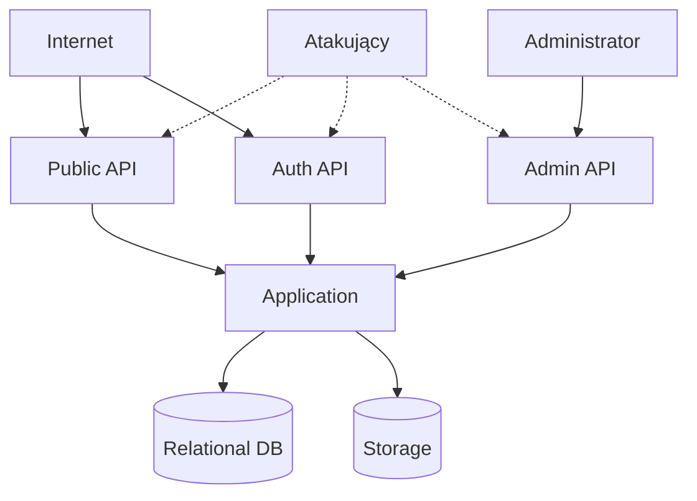

# Model Zagrożeń

## Cel dokumentu
Identyfikuje główne zagrożenia dla systemu i oczekiwane środki zaradcze.

## Status dokumentu
- Status: draft
- Zakres: model zagrożeń dla stanu docelowego
- Ostatnia aktualizacja: 2026-07-12

## Stan obecny
- Model zagrożeń jest planem bezpieczeństwa, nie opisem wdrożonych mechanizmów.

## Stan docelowy
- Każde krytyczne ryzyko ma przypisane zabezpieczenie, monitoring i właściciela decyzji.

## Główne zasoby chronione
- Konta użytkowników
- Prywatne zdjęcia i filmy
- Linki dostępu i tokeny
- Archiwa ZIP
- Dane planów i limitów
- Logi audytowe

## Główne wektory ataku
| Zagrożenie | Skutek | Mitigacja |
| --- | --- | --- |
| Brute force logowania | przejęcie konta | rate limiting, blokada konta, MFA w przyszłości |
| Enumeracja galerii przez slug | ujawnienie istnienia wydarzeń | niezgadnialne tokeny, opcjonalny kod dostępu, ograniczanie odpowiedzi |
| Niebezpieczny upload | wykonanie kodu lub DoS | walidacja typów, izolacja storage, limity |
| Błąd ownership | dostęp do cudzych plików | kontrola w use case i repozytorium |
| Nadużycie uprawnień admina | naruszenie prywatności | silny audyt, ograniczenie ról, procedury operacyjne |
| Wycieki z logów | ujawnienie danych osobowych | redakcja danych wrażliwych, polityka logowania |

## Diagram zagrożeń

## Powiązane dokumenty
- [SECURITY_REQUIREMENTS.md](SECURITY_REQUIREMENTS.md)
- [PRIVACY_AND_DATA_RETENTION.md](PRIVACY_AND_DATA_RETENTION.md)
- [../operations/INCIDENT_RESPONSE.md](../operations/INCIDENT_RESPONSE.md)

## Decyzje otwarte
- Czy po uruchomieniu produkcji wykonać formalny przegląd threat model przed pierwszą kampanią marketingową.
